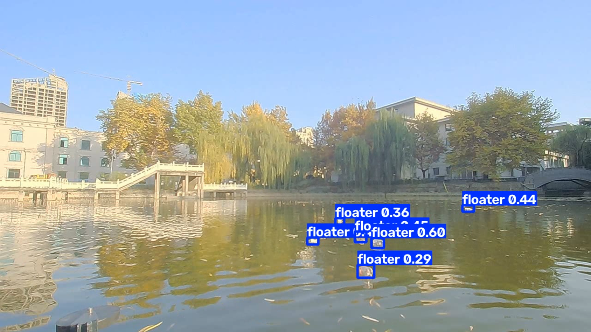

# 🌊 Aquatic Waste Detection using YOLOv8

<p align="center">
  
</p>

<h3 align="center">AI-Based Floating Object Detection for an Aquatic Cleaning Boat</h3>

<p align="center">
  YOLOv8 • OpenCV • Computer Vision • Deep Learning
</p>

---

## 📌 Overview

This project is a **YOLOv8-based computer vision model for detecting floating objects on water surfaces**.

It was developed as the AI detection component of an **Aquatic Cleaning Boat** project.

The primary objective is to detect floating objects that can potentially be collected by an aquatic waste-cleaning system.

Instead of identifying the exact type of waste, the current model uses a **single detection class**:

```text
0 → floater
````

This allows the system to focus on the main requirement:

> **Detect objects floating on the water surface.**

The trained model can be used with:

* 📷 Live webcam
* 🎥 Video files
* 🖼️ Images
* 🤖 Future edge-device deployment

---

# 🎯 Project Objective

The goal of this project is to develop a lightweight computer vision model capable of identifying floating objects in different water environments.

The detection output can eventually be used by an autonomous aquatic cleaning boat to determine where floating objects are located.

### Detection Concept

```text
             Camera / Video
                    │
                    ▼
                 OpenCV
                    │
                    ▼
                YOLOv8n
                    │
                    ▼
          Floating Object Detection
                    │
             ┌──────┴──────┐
             ▼             ▼
        Bounding Box    Confidence
             │
             ▼
      Future Boat Control
```

---

# 🧠 Model Information

| Property             | Value            |
| -------------------- | ---------------- |
| Model                | YOLOv8n          |
| Task                 | Object Detection |
| Number of Classes    | 1                |
| Class ID             | 0                |
| Class Name           | `floater`        |
| Input Image Size     | 640 × 640        |
| Training Images      | 3,780            |
| Validation Images    | 420              |
| Total Images         | 4,200            |
| Annotated Objects    | 26,937           |
| Training Epochs      | 10               |
| Batch Size           | 4                |
| Training Device      | CPU              |
| Confidence Threshold | 0.25             |
| Model Size           | ~6.2 MB          |

---

# 📊 Dataset

The model was trained using a combination of two floating-object datasets:

## 1. FloW Dataset

The FloW dataset was used to provide water-surface scenes containing floating objects.

## 2. IWHR Floater Dataset

The IWHR Floater dataset contains annotated floating objects in inland water environments.

The original IWHR annotations were provided in **Pascal VOC XML format** and were converted to **YOLO annotation format** before training.

---

# 🔄 Dataset Preparation

The datasets were prepared and combined into a single one-class detection dataset.

### IWHR Dataset

```text
Training Images:     2,700
Validation Images:     300
```

### FloW Dataset

```text
Training Images:     1,080
Validation Images:     120
```

### Final Dataset

```text
Training Images:      3,780
Validation Images:      420
Total Images:         4,200

Annotated Objects:   26,937
Classes:                  1
```

The final class mapping is:

```text
0 → floater
```

The original datasets are **not included in this repository**.

---

# 🏋️ Training

The final model was trained using **YOLOv8n**.

### Training Configuration

```text
Model:       YOLOv8n
Epochs:      10
Image Size:  640
Batch Size:  4
Device:      CPU
Workers:     0
```

Training was performed on an:

```text
AMD Ryzen 3 7320U
```

The complete 10-epoch training process took approximately:

```text
4.99 hours
```

---

# 📈 Model Performance

The final validation performance after 10 epochs was:

| Metric    |     Score |
| --------- | --------: |
| Precision | **89.7%** |
| Recall    | **75.6%** |
| mAP50     | **85.6%** |
| mAP50-95  | **58.0%** |

### Performance Summary

The trained model achieved:

* **89.7% Precision**
* **75.6% Recall**
* **85.6% mAP50**
* **58.0% mAP50-95**

The model demonstrates good capability for detecting floating objects in water scenes.

The current model is intended as a practical detection baseline and can be further improved with additional real-world training data.

---

# 📉 Training Results

Training and validation metrics are available in:

```text
results/training/results.png
```

The training results include:

* Training box loss
* Training classification loss
* Training DFL loss
* Validation box loss
* Validation classification loss
* Validation DFL loss
* Precision
* Recall
* mAP50
* mAP50-95

Additional evaluation visualizations are available:

```text
results/training/confusion_matrix.png

results/training/confusion_matrix_normalized.png

results/training/labels.jpg
```

---

# 🖼️ Detection Results

Example detection outputs are available in:

```text
results/detection/
```

Current examples include:

```text
detection_1.png
detection_2.png
detection_3.png
```

These images demonstrate the trained YOLOv8 model detecting floating objects in water scenes.

---

# ⚙️ Installation

## 1. Clone the Repository

```bash
git clone <YOUR-GITHUB-REPOSITORY-URL>
```

Then enter the repository:

```bash
cd AQUATIC-WASTE-YOLOV8
```

---

## 2. Create a Virtual Environment

### Windows

```bash
python -m venv .venv
```

Activate it using PowerShell:

```powershell
.venv\Scripts\Activate.ps1
```

Or using Command Prompt:

```cmd
.venv\Scripts\activate
```

---

## 3. Install Dependencies

```bash
pip install -r requirements.txt
```

---

# 📦 Requirements

The main libraries used in this project are:

```text
Ultralytics YOLO
OpenCV
NumPy
```

The required versions are specified in:

```text
requirements.txt
```

---

# 📷 Live Webcam Detection

The repository includes a webcam inference script:

```text
inference/webcam_detection.py
```

Run:

```bash
python inference/webcam_detection.py
```

The script automatically loads:

```text
models/best.pt
```

and starts detection using the default webcam.

The output displays:

* Bounding boxes
* Class name
* Confidence score

### Stop Detection

Press:

```text
Q
```

to close the webcam detection window.

---

# 🎥 Video Detection

The repository also includes:

```text
inference/video_detection.py
```

This script can be used to test the model on recorded water-surface videos.

Run:

```bash
python inference/video_detection.py --source "path/to/video.avi"
```

Example:

```bash
python inference/video_detection.py --source "Sequence_46.avi"
```

The default confidence threshold is:

```text
0.25
```

A custom confidence threshold can also be specified:

```bash
python inference/video_detection.py --source "Sequence_46.avi" --conf 0.25
```

The script performs YOLOv8 inference and generates an annotated video containing the detected floating objects.

---

# 🔍 Using the Trained Model Directly

The trained model is located at:

```text
models/best.pt
```

It can also be loaded directly using Ultralytics:

```python
from ultralytics import YOLO

model = YOLO("models/best.pt")

results = model.predict(
    source="image.jpg",
    conf=0.25
)

results[0].show()
```

---

# 🏷️ Detection Class

This project intentionally uses only one class.

```text
Class ID:    0
Class Name:  floater
```

The model does **not** currently classify the detected object as plastic, paper, metal, glass, etc.

For the aquatic cleaning boat, the primary requirement is to identify:

```text
Where is the floating object?
```

rather than:

```text
What material is the object made from?
```

This simplifies the detection system and allows the future boat-control system to focus on object location and collection.

---

# ⚠️ Current Limitations

Although the model performs well on many water scenes, some challenging conditions can produce false detections or missed detections.

Potential sources include:

* Water reflections
* Shadows
* Sunlight glare
* Waves
* Ripples
* Strong water textures
* Objects that are very small or distant

For example, reflections or shadows can sometimes have visual characteristics similar to actual floating objects.

Therefore, the current model should be considered a **strong detection baseline**, rather than a completely error-free real-world system.

---

# 🚀 Future Improvements

The model can be improved further using additional training and testing.

## 1. Hard-Negative Training

Add images containing:

* Empty water
* Shadows
* Reflections
* Sun glare
* Waves
* Ripples

These examples can help the model learn what should **not** be detected as a floater.

## 2. Real-World Data Collection

Collect additional images directly from the camera that will be mounted on the aquatic cleaning boat.

Data should include:

* Different lighting conditions
* Different weather conditions
* Different water surfaces
* Different camera angles
* Small floating objects
* Distant floating objects
* Partially visible objects

## 3. Confidence Threshold Optimization

Different confidence thresholds can be evaluated to find the best balance between:

```text
False Positives
       ↕
False Negatives
```

## 4. Model Optimization

The trained model can be optimized for faster inference on edge computing hardware.

## 5. Edge Deployment

Future work includes deploying the trained model on a **Raspberry Pi 5** as part of the larger aquatic cleaning boat system.

---

# 🤖 Future Aquatic Cleaning Boat Integration

The current repository focuses only on the AI detection module.

The future complete system can connect:

```text
Camera
  ↓
YOLOv8 Floater Detection
  ↓
Object Position
  ↓
Navigation / Control Logic
  ↓
Aquatic Cleaning Mechanism
  ↓
Floating Waste Collection
```

The AI model can therefore serve as the perception component of the larger autonomous aquatic cleaning boat.

---

# 📌 Project Status

```text
Dataset Preparation         ✅
FloW Dataset Preparation    ✅
IWHR Dataset Preparation    ✅
Dataset Combination         ✅
YOLO Annotation             ✅
Dataset Validation          ✅
YOLOv8 Training             ✅
Model Evaluation            ✅
Video Testing               ✅
Webcam Testing              ✅
Model Repository             ✅

Further Accuracy Improvement 🔄
Raspberry Pi Deployment       🔄
Boat Integration              🔄
```

---

# 🧪 Testing

The model was tested on water-surface videos and detection examples.

A confidence threshold of approximately:

```text
0.25
```

was found to provide a useful balance for practical testing.

The detection results included multiple floating objects in several water environments.

---

# 📂 Model Files

The main trained model is:

```text
models/best.pt
```

Model architecture:

```text
YOLOv8n
```

Number of classes:

```text
1
```

Class:

```text
floater
```

Approximate model size:

```text
6.2 MB
```

---

# 📜 Dataset Attribution

This project uses the:

* FloW dataset
* IWHR Floater dataset

The original datasets are **not included in this repository**.

Please obtain the datasets from their respective official sources and follow their individual licensing, attribution, and usage requirements.

The dataset annotations were used for research and model development according to the applicable dataset terms.

---

# 🛠️ Technologies Used

| Technology  | Purpose                  |
| ----------- | ------------------------ |
| Python      | Programming              |
| YOLOv8      | Object Detection         |
| Ultralytics | YOLO Framework           |
| OpenCV      | Image & Video Processing |
| PyTorch     | Deep Learning Backend    |
| NumPy       | Numerical Processing     |

---

# 👨‍💻 Project

## Aquatic Cleaning Boat

### AI Floating Object Detection Module

This repository contains the **YOLOv8 computer vision component** developed for an aquatic cleaning boat project.

The broader project aims to combine computer vision, embedded systems, robotics, and aquatic waste collection into an autonomous cleaning platform.

---

# ⭐ Acknowledgments

Special thanks to the researchers and developers behind the FloW and IWHR floating-object datasets and the Ultralytics YOLO framework.

---

# 📄 License

This repository contains project code, model files, and result visualizations.

Please check the licenses and usage requirements of the third-party datasets and software dependencies before redistributing or using them commercially.

---

## 🌊 Final Note

The current model demonstrates that a lightweight YOLOv8 detector can identify floating objects across a variety of water scenes.

The next stage of development is to improve robustness against challenging conditions such as reflections and shadows and eventually deploy the model on an edge device for integration with the aquatic cleaning boat.
